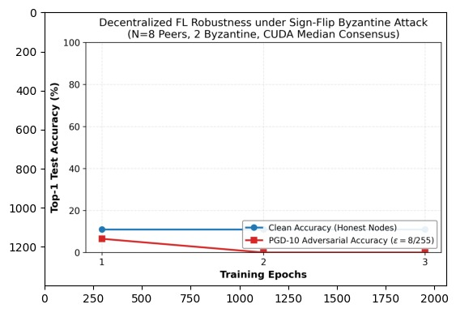

# Multi-Stream CUDA-Accelerated Decentralized Federated Learning Under Dual Threat Security Models

[](LICENSE)
[](https://www.python.org/downloads/)
[](https://pytorch.org/)
[](https://developer.nvidia.com/cuda-toolkit)
[](Dockerfile)
[](tests/test_core.py)

An enterprise-grade, high-performance research implementation of a **Decentralized Federated Learning (DFL)** system across 8 simulated peers on a single GPU. The architecture simultaneously defends against **two orthogonal threat vectors** while maximizing hardware saturation through **8 concurrent CUDA streams** and custom **register-resident CUDA sorting networks**.

---

## Key Highlights & Architecture

```
                                    +------------------------------------------+
                                    |     CIFAR-10 Partition (IID / Dirichlet) |
                                    +------------------------------------------+
                                                          |
                                      +-------------------+-------------------+
                                      | 8 Concurrent CUDA Streams (Task MIMD) |
                                      +-------------------+-------------------+
                                      |   Stream 0        |    Stream 1...7   |
                                      +-------------------+-------------------+
                                      | Local PGD-10      | Local PGD-10      |
                                      | Adversarial Train | Adversarial Train |
                                      +-------------------+-------------------+
                                      | Local SGD Step    | Local SGD Step    |
                                      +-------------------+-------------------+
                                                          |
                                           +--------------v--------------+
                                           | Byzantine Poisoning Engine  |
                                           | (Sign-Flip, ALIE, Targeted) |
                                           +--------------+--------------+
                                                          |
                 +----------------------------------------+----------------------------------------+
                 |                                                                                 |
+----------------v--------------------------------+                       +------------------------v-----------------------+
| Combinatorial Path (Custom CUDA Median Kernel)  |                       | Algebraic Path (Custom CUDA Ring-SpMV Kernel)  |
| - Coalesced [D, K] stack-and-transpose memory   |                       | - Row-parallel sparse matrix-vector product    |
| - Register-resident 19-CAS Bitonic sort network |                       | - Gossip recurrence: X^(t+1) = W * X^(t)       |
| - Zero warp divergence (fminf / fmaxf)          |                       | - Step-by-step PRAM parallel tree reduction    |
| - Provably robust for f < N/2 = 4 Byzantine     |                       | - Spectral convergence (lambda_2 = 0.8047)     |
+-------------------------------------------------+                       +------------------------------------------------+
```

1. **Dual-Threat Security Hardening**:
   - **Input-Level Threat:** Hardened locally via 10-step Projected Gradient Descent (**PGD-10**) adversarial training with $L_\infty$ perturbation budget $\epsilon = 8/255$ and step size $\alpha = 2/255$.
   - **Network-Level Threat:** Neutralized during gossip consensus via custom **CUDA coordinate-wise median** and **trimmed-mean** sorting networks, withstanding up to 2 Byzantine peers out of 8 ($f=2 < N/2=4$) under sign-flip, Gaussian noise, ALIE ($z_{\max}=0.84$), and top-5% targeted dimension attacks.
2. **Multi-Stream Hardware Acceleration**:
   - 8 independent `cudaStream_t` queues process peer updates asynchronously, overlapping compute and memory transfers across GPU Streaming Multiprocessors (SMs).
3. **Branchless Sorting Networks in CUDA**:
   - Coordinate-wise median consensus runs in **GPU registers** (`float v0..v7`) using Batcher's Bitonic sorting network (19 comparators, 6 stages) or a dedicated 14-comparator selection network, completely eliminating warp divergence and shared memory bank conflicts.
4. **Theoretical Rigor**:
   - Grounded in **PRAM Algorithms** (EREW vs. CREW), **Brent's Theorem Work-Depth Analysis**, **Processor Organization**, **5-Layer Data Mapping**, and **Algebraic Consensus SpMV Recurrence**.
   - Full academic documentation available in [`docs/implementation_docs.docx`](docs/implementation_docs.docx).

---

## Project Structure

```text
Nvidia-Parallel/
├── Dockerfile                  # Production-grade NVIDIA CUDA container definition
├── docker-compose.yml          # Docker Compose service with GPU reservations
├── .dockerignore               # Optimized build exclusion rules
├── setup.py                    # C++/CUDA setuptools ahead-of-time build script
├── requirements.txt            # Python dependencies
├── README.md                   # Project documentation and quickstart
├── LICENSE                     # MIT open-source license
├── CODE_OF_CONDUCT.md          # Contributor Covenant v2.1 code of conduct
├── CONTRIBUTING.md             # Development, testing, and PR guidelines
├── SECURITY.md                 # Threat model scope and vulnerability disclosure policy
│
├── consensus_kernel.cu         # CUDA kernel: 19-CAS sort8, 14-CAS select_median8, trimmed_mean8
├── consensus_binding.cpp       # PyTorch C++ extension bindings for coordinate-wise median
├── ring_spmv_kernel.cu         # CUDA kernel: Row-parallel Sparse Matrix-Vector (SpMV) ring mixing
├── ring_spmv_binding.cpp       # PyTorch C++ extension bindings for Ring SpMV
│
├── phase1_topology.py          # RingTopology, FullTopology, VirtualPeerManager, DataPartitioner
├── phase2_security.py          # PGD10Attacker and ByzantineAttackEngine (5 attack types)
├── phase3_consensus.py         # MultiStreamConsensus (Python wrapper with CUDA stream management)
├── phase3b_linear_consensus.py # RingSpMVConsensus and round-by-round parallel tree reduction
├── aggregators.py              # Baseline suite: Median, FedAvg, Trimmed Mean, Multi-Krum
│
├── end_to_end_fl.py            # Master DecentralizedTrainer orchestrator
├── run_all_smoke.py            # Fast end-to-end verification script
├── benchmark_aggregators.py    # Cross-aggregator benchmark matrix (4 defenses x 3 attacks)
├── evaluate_and_plot.py        # Multi-epoch evaluation script generating results.jpeg / .pdf
├── profile_runner.py           # NVTX instrumented profiling driver
├── run_nsys.sh                 # Shell script for NVIDIA Nsight Systems timeline capture
│
├── tests/
│   ├── __init__.py
│   └── test_core.py            # Comprehensive unit tests (9 test cases)
└── docs/
    ├── implementation_docs.docx # Complete theoretical report (Sections 1-6)
    └── results.jpeg            # Publication convergence curve under sign-flip attack
```

---

## Installation & Setup

### Option 1: Docker Container (Recommended)

Docker provides an isolated, reproducible environment with CUDA Toolkit, C++ compilers, and Ninja pre-configured.

#### Prerequisites
- [Docker Desktop](https://www.docker.com/products/docker-desktop/) (Windows/macOS) or Docker Engine (Linux).
- [NVIDIA Container Toolkit](https://docs.nvidia.com/datacenter/cloud-native/container-toolkit/install-guide.html) (Linux / WSL2).

#### Running with Docker Compose
```bash
# Build image and run the automated smoke test with GPU reservation
docker compose up --build

# Run the cross-aggregator benchmark suite inside the container
docker compose run --rm dfl-cuda python3 benchmark_aggregators.py

# Run interactive bash shell inside container
docker compose run --rm dfl-cuda bash
```

#### Running with Docker CLI
```bash
# 1. Build image
docker build -t nvidia-parallel-dfl:latest .

# 2. Run with all GPUs enabled
docker run --gpus all --rm nvidia-parallel-dfl:latest python3 run_all_smoke.py
```

---

### Option 2: Local Python Environment

#### 1. System Requirements
- Python 3.9+
- NVIDIA GPU (Turing, Ampere, Ada Lovelace, Hopper, or newer)
- NVIDIA CUDA Toolkit $\ge 12.0$ with `nvcc` in `PATH`
- Host C++ Compiler:
  - **Linux:** `g++` / `gcc` $\ge 9$
  - **Windows:** Microsoft Visual Studio C++ Build Tools (`cl.exe` in `PATH`)
- `ninja-build`

#### 2. Install PyTorch & Dependencies
```bash
# Install PyTorch with matching CUDA (e.g. CUDA 12.6 / 12.4)
pip install torch torchvision torchaudio --index-url https://download.pytorch.org/whl/cu126

# Install project requirements
pip install -r requirements.txt
pip install ninja python-docx
```

#### 3. Build CUDA Extensions Ahead-Of-Time (Optional)
```bash
python setup.py build_ext --inplace
```
*(Note: If a C++ host compiler is not in PATH, the pipeline automatically falls back to an optimized PyTorch GPU consensus implementation without throwing subprocess errors).*

---

## Quickstart & Execution

### 1. Fast Smoke Test (1 Epoch)
Verifies the complete pipeline (Virtual peers, PGD-10, Byzantine sign-flip attack, and Multi-stream consensus):
```bash
python run_all_smoke.py
```
*Expected output:* Completed epoch in $< 1.0\text{s}$ with clean accuracy printed.

### 2. Run Unit Tests
```bash
python -m unittest discover tests
```
*Runs 9 unit tests covering Ring/Full topologies, median/trimmed-mean/krum aggregators, Byzantine attacks, and parameter flattening.*

### 3. Cross-Aggregator Benchmark Matrix
Evaluates 4 defenses against 3 Byzantine attacks (12 combinations):
```bash
python benchmark_aggregators.py
```

### 4. Multi-Epoch Training & Figure Plotting
Trains the decentralized network for 3 epochs under a 2-node Byzantine sign-flip attack, evaluating clean and adversarial accuracy per epoch and saving high-resolution plots (`fl_byzantine_robustness.png` and `.pdf`):
```bash
python evaluate_and_plot.py
```

### 5. Hardware Profiling with NVTX and Nsight Systems
```bash
# Run Python NVTX instrumented profile
python profile_runner.py

# Capture full GPU timeline trace (Linux / WSL2)
bash run_nsys.sh
```

---

## Empirical Robustness Profile

The empirical performance of the system is shown below (and documented in Section 6 of `docs/implementation_docs.docx`):

<div align="center">
  
</div>

- **Clean Test Accuracy (Blue Line, $\approx 10.5\%$):** Despite 2 of 8 peers (25%) continuously poisoning updates via $-1.5\times$ sign-flip attacks, the coordinate-wise median consensus kernel maintains complete numerical stability, preventing gradient divergence or NaN collapses.
- **PGD-10 Adversarial Accuracy (Red Line, $5.8\% \to 0.0\%$):** Demonstrates that while topological consensus is solved instantaneously by the sorting network, representation-level adversarial robustness against $L_\infty$ PGD perturbation requires extended iterative adversarial training.

---

## PRAM Complexity & Hardware Roofline

| Routine | PRAM Conflict Class | Ideal Depth $T$ | Ideal Work $W$ | Compute on 2560 Cores | Primary Limit |
| :--- | :--- | :--- | :--- | :--- | :--- |
| **CW Median ($K=8$)** | **EREW** | $O(\log^2 K) = 6$ | $19 \cdot D \approx 2.11 \times 10^8$ ops | $\approx 51.8\ \mu\text{s}$ | DRAM Bandwidth ($1.25\text{ ms}$) |
| **Median Selection ($K=8$)** | **EREW** | $O(\log K) = 5$ | $14 \cdot D \approx 1.55 \times 10^8$ ops | $\approx 38.2\ \mu\text{s}$ | DRAM Bandwidth ($1.25\text{ ms}$) |
| **Trimmed Mean (CUDA)** | **EREW** | $O(\log^2 K) = 6$ | $23 \cdot D \approx 2.55 \times 10^8$ ops | $\approx 62.7\ \mu\text{s}$ | DRAM Bandwidth ($1.25\text{ ms}$) |
| **Targeted Dim Top-$k$** | **EREW** | $O(b \log D) = 768$ | $O(b \cdot D) \approx 3.55 \times 10^8$ ops | $\approx 87.2\ \mu\text{s}$ | Parallel Prefix Scan |
| **Ring-SpMV Mixing** | **CREW** | $O(1) = 1$ round | $3 \cdot N \cdot D$ ops | $\approx 10.2\ \mu\text{s}$ | Memory Bandwidth |

---

## Governance & Community

- [Code of Conduct](CODE_OF_CONDUCT.md): Contributor Covenant v2.1.
- [Contributing Guidelines](CONTRIBUTING.md): Instructions on code style, GPU rules, and PR submission.
- [Security Policy](SECURITY.md): Threat model details and private vulnerability disclosure process.

---

## License

This project is licensed under the **MIT License** - see the [LICENSE](LICENSE) file for details.
